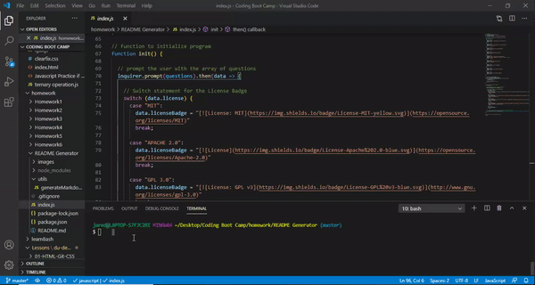
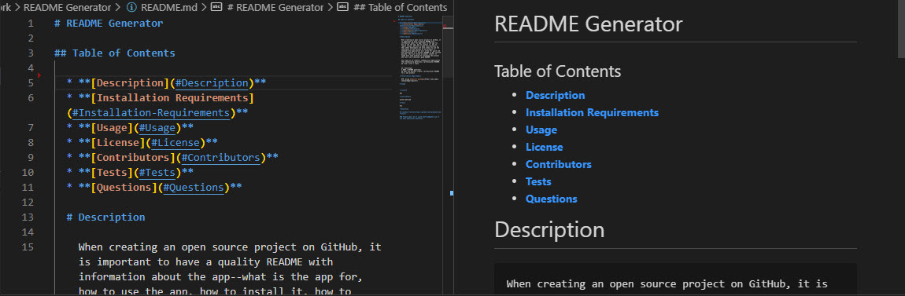

# README Generator

Link to video: https://www.dropbox.com/s/1plcsqjbvhn0woo/README%20Generator%20Video.mp4?dl=0

Live site: https://jaredseefried.github.io/README-Generator/

## Table of Contents

* **[Description](#Description)**  
* **[Installation Requirements](#Installation-Requirements)**  
* **[Usage](#Usage)**  
* **[License](#License)**    
* **[Contributors](#Contributors)**  
* **[Tests](#Tests)**  
* **[Questions](#Questions)** 
    
# Description

When creating an open source project on GitHub, it is important to have a quality README with information about the app--what is the app for, how to use the app, how to install it, how to report issues, and how to make contributions so that other developers are more likely to use and contribute to the success of the project. A command-line application will allow for quick and easy generation of a project README to get started quickly. This will allow a project creator to spend more time working on finishing the project and less time creating a good README.

Your task is to create a command-line application that dynamically generates a professional README.md from a user's input.

AS A developer
I WANT a README generator
SO THAT can quickly create a professional README for a new project

# Installation Requirements

NPM: Using [Inquirer package](https://www.npmjs.com/package/inquirer).

# Usage

# License 

MIT

# Contributors

Jared Seefried

# Tests

# Questions

### [Github Profile: github.com/jaredseefried](https://github.com/jaredseefried "Title")

### Please email me at jared.seefried@yahoo.com if you have additional questions. 
---
## Image of README Generator
